### ⭐ 系统亮点

1. 支持云快充通信协议 ｜ 华为FusionCharge ｜ 支持分时电价 ｜ 支持停车系统

2. 支持设备监控预警 ｜ 支持中电联互联互通 ｜ 支持各地区市政平台对接

3. 微服务架构 ｜ 系统-业务模块分离 ｜ 多租户 ｜ 高可用 ｜ 动态伸缩 ｜ 无感升级

4. 采用 SpringCloud + Mybatis-Plus + Redis + RabbitMQ + Smart-Socket 高并发方案

5. 系统内置“模拟桩”模块，可进行仿真充电，方便业务调试

```
1.易维护：基于Ruoyi-Cloud-Plus脚手架搭建，脚手架与业务模块分离，易于升级更新；
2.前后端分离：后端采用SpringCloud，关联端采用vue-admin-element，移动端采用uni-app；
3.权限管理：基于ruoyi体系，支持多租户；
4.二次开发能力：业务模块独立，方便业务扩展；
5.快速上手：完备的用户使用文档、可基于docker编排10分钟快速搭建环境；
6.系统安全：支持接口数据加密、全局操作日志等；
7.高性能：基于Smart-socket通信架构，2CPU+4G单机支持2000台以上充电桩进行业务交换；
8.互通能力：支持对接特来电、快电、新电途、e充电、星星充电等各家充电平台。
```

### 💻 运行环境

```
nginx:1.22.1
mysql:8
redis:6.2.7
xxl-job-admin:2.3.1（可选）
rabbitmq:3.10.6
minio（可选）
nacos-server:v2.1.1
Java17
```

### 🔨 业务模块结构

- omind-api：业务内部接口模块集合

```
omind-api-baseplat：充电基础设施服务外部接口模块
omind-api-common：通用模块
omind-api-mq：通用消息队列模块
omind-api-user-mq：用户客户端服务外部接口模块
omind-api-userplat：充电运营服务外部接口模块
```

- omind-modules：业务模块集合

```
omind-baseplat：充电基础设施服务模块
omind-userplat：充电运营服务模块
omind-mp：用户客户端服务模块
omind-simplat：模拟充电桩模块
```

2核4G设备服务器（单机）；
* 一万快充桩在线；
* 一千快充桩并发充电业务；

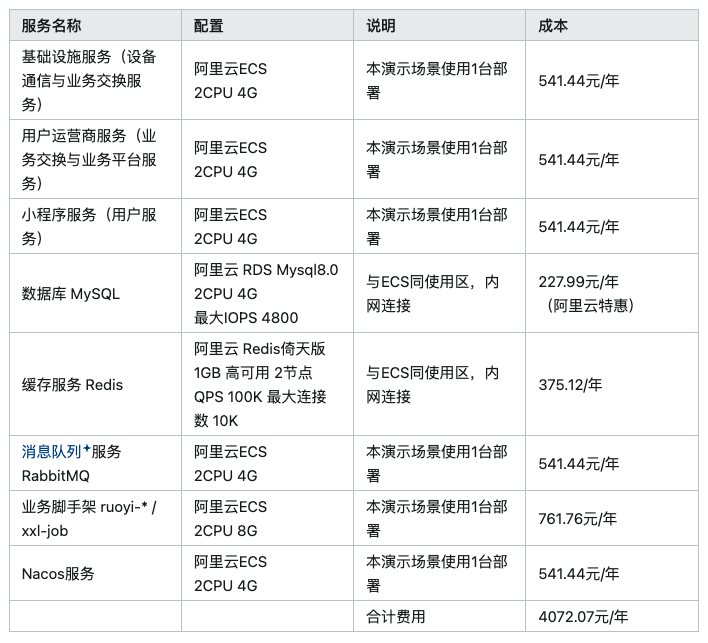

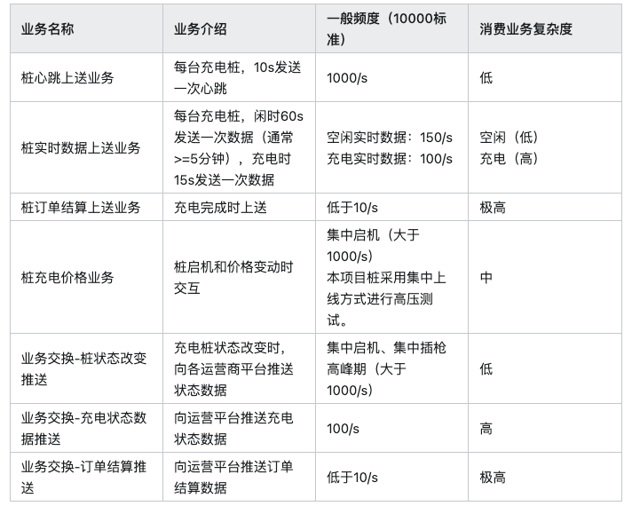


### ⚙️ 快速开始

使用docker-compose快速构建模拟系统

[👉 开始构建服务]

项目初始化
* 项目必备环境
* 提示

建议首次部署使用Dokcer安装，项目内置docker编排文件可快速部署运行。

* openJDK 17
* MySQL 8.0+
* Redis 5.x 6.x 7.x
* minio 或等效S3协议的对象存储
* maven >= 3.8.x
* node.js 18
* nacos 2.1.x

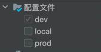

提示

* 开发机本地部署请勾选local
* 想快速体验，请使用云端调试部署模式，请勾选dev（建议）

默认 JDK-17 如有变动需要更新以下配置

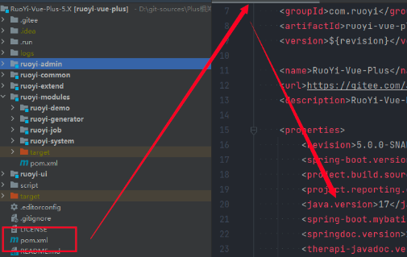

对外服务端口

* 80
* 443

部署步骤

提示

本项目测试环境基于Ubuntu 22.04 64位操作系统举例，dev环境将所有系统和业务服务部署到一台4CPU+32G内存的云服务器端

## 1. 安装Docker

a. 更新 apt 包索引并安装 ca-certificates、curl、gnupg、lsb-release等，以允许 apt 通过 HTTPS 使用存储库;

```
apt update
sudo apt install -y ca-certificates curl gnupg lsb-release
```

b. 添加 Docker 的官方 GPG 密钥;

```
curl -fsSL https://download.docker.com/linux/ubuntu/gpg | sudo gpg --dearmor -o /usr/share/keyrings/docker-archive-keyring.gpg

curl -fsSL https://download.docker.com/linux/ubuntu/gpg | sudo gpg --dearmor -o /usr/share/keyrings/docker-archive-keyring.gpg
```

c. 使用下面命令设置 stable 仓库。

```
echo "deb [arch=$(dpkg --print-architecture) signed-by=/usr/share/keyrings/docker-archive-keyring.gpg] https://download.docker.com/linux/ubuntu $(lsb_release -cs) stable" | sudo tee /etc/apt/sources.list.d/docker.list > /dev/null

echo "deb [arch=$(dpkg --print-architecture) signed-by=/usr/share/keyrings/docker-archive-keyring.gpg] https://download.docker.com/linux/ubuntu $(lsb_release -cs) stable" | sudo tee /etc/apt/sources.list.d/docker.list > /dev/null
```

d. 安装最新版本的 Dokcer Engine

```
sudo apt update
sudo apt install docker-ce docker-ce-cli containerd.io

sudo apt-get update
sudo apt install docker-ce docker-ce-cli containerd.io -y
```

提示

安装指定版本的 Dokcer Engine，首先使用cpt-cache命令查看仓库中 docker-ce 的版本，选择对应的版本，使用install命令安装。

e. Docker Compose 安装方法

运行下面的命令将 Docker Compose 1.29.2 的二进制版本安装到 /usr/local/bin/docker-compose 中。 要安装不同版本的 Compose，请将 1.29.2 替换为您要使用的 Compose 版本。

```
sudo curl -L "https://github.com/docker/compose/releases/download/1.29.2/docker-compose-$(uname -s)-$(uname -m)" -o /usr/local/bin/docker-compose

sudo curl -L "https://github.com/docker/compose/releases/download/1.29.2/docker-compose-$(uname -s)-$(uname -m)" -o /usr/local/bin/docker-compose
sudo chmod +x /usr/local/bin/docker-compose
```

提示

对二进制文件 /usr/local/bin/docker-compose 赋予可执行权限。

将项目目录下docker文件夹全部内容拷贝至服务器端，如/usr/local/omind/目录下

3. 开始启动服务

请先将编译成功的服务模块镜像推送至Docker服务器

依次执行以下命令，每个服务启动成功后执行下一条

启动nginx

```
docker-compose --compatibility up -d nginx
```

启动Redis

```
docker-compose --compatibility up -d redis
```

启动MySQL

```
docker-compose --compatibility up -d mysql
```

提示

数据库初始化sql均存放在docker\mysql\init目录下，在容器启动后会自动载入，如需要更新或者重置数据，请替换sql并删除data目录下的数据文件。

启动xxl-job

```
docker-compose --compatibility up -d xxl-job
```

提示

xxl-job 已预置地图更新任务、桩验活任务、站点数据同步任务

启动RabbitMQ

```
docker-compose --compatibility up -d rabbitmq
```

提示

充电桩状态、充电状态数据均采用MQ传递，如启动失败，则无法正常体验充电流程

启动Minio

```
docker-compose --compatibility up -d minio
```

提示

体验模式可以不部署

启动Nacos

```
docker-compose --compatibility up -d nacos
```

提示

MacOS ARM环境下，请修改docker-compose，使用 nacos/nacos-server:v2.1.2-slim 镜像
启动Nacos成功后，如数据库初始化失败，请创建dev命名空间，并导入config目录下对应的配置文件

```
启动ruoyi-gateway 网关服务
docker-compose --compatibility up -d ruoyi-gateway
启动ruoyi-auth 通用服务
docker-compose --compatibility up -d ruoyi-auth
启动ruoyi-system 系统服务
docker-compose --compatibility up -d ruoyi-system
启动uoyi-resource 资源服务
docker-compose --compatibility up -d ruoyi-resource
启动omind-baseplat 充电基础基础设施服务
docker-compose --compatibility up -d omind-baseplat
启动omind-userplat 充电运营服务
docker-compose --compatibility up -d omind-userplat
启动omind-simplat 充电桩模拟器
docker-compose --compatibility up -d omind-simplat
启动omind-mp 充电用户端（小程序）服务
docker-compose --compatibility up -d omind-mp
```

## 业务模块结构

* omind-api：业务内部接口模块集合
* omind-api-baseplat：充电基础设施服务外部接口模块
* omind-api-common：通用模块
* omind-api-mq：通用消息队列模块
* omind-api-user-mq：用户客户端服务外部接口模块
* omind-api-userplat：充电运营服务外部接口模块
* omind-modules：业务模块集合
* omind-baseplat：充电基础设施服务模块
* omind-userplat：充电运营服务模块
* omind-mp：用户客户端服务模块
* omind-simplat：模拟充电桩模块

## API文档

```
业务：omind-baseplat 充电基础设施服务
http://[服务器IP]:9801/swagger-ui/index.html
业务：omind-simplat 充电桩模拟器
http://[服务器IP]:9804/swagger-ui/index.html
业务：omind-userplat 充电运营服务
http://[服务器IP]:9805/swagger-ui/index.html
业务：omind-mp 充电用户端（小程序）服务
http://[服务器IP]:9807/swagger-ui/index.html
系统：ruoyi-auth 通用服务
http://[服务器IP]:9210/swagger-ui/index.html
系统：ruoyi-system 系统服务
http://[服务器IP]:9201/swagger-ui/index.html
系统：ruoyi-resource 资源服务
http://[服务器IP]:9204/swagger-ui/index.html
```

常见问题

node-sass 相关库安装报错

node-sass 是一个让人头痛的库，目前本项目的解决方案是通过根目录下的.npmrc来指定该库的安装源。 如果安装时，报node-gyp node-pre-gyp相关的错误，可能是这个库的错误导致，请确认.npmrc文件下该源是否配置正确。

```
registry=https://registry.npm.taobao.org
sass_binary_site=https://npmmirror.com/mirrors/node-sass/
```

[👉 模拟桩使用教程]

* omind-simplat: 模拟桩服务
* omind-baseplat: 充电基础设施服务
* omind-userplat: 充电运营服务
* omind-mp: 充电客户端（小程序）服务
* orise-mp: 充电小程序
* 其他：xxl-job RabbitMQ MySQL Redis Nacos ruoyi-*

提示

如果仅测试模拟桩是否可以启动成功，仅需要启动simplat和baseplat两个服务即可验证

### 🌈 核心功能


- 系统基于互联互通协议，充电运营服务支持对接多个自有/第三方平台（如特来电、快电、新电途、e充电）和市政充电平台；
- 系统基础服务采用ruoyi框架，独立与业务模块，可无干扰同步升级系统非业务功能；
- 充电基础设施服务支持多类充电桩，支持一站多种不同协议混合使用；
- 系统支持动态伸缩，服务增减对业务0影响；
- 系统内部采用Dubbo通信，低延迟。


### 🖥️ UI界面展示

- T／CEC 102.1—2016 电动汽车充换电服务信息交换 第1部分：总则
- T／CEC 102.2—2016 电动汽车充换电服务信息交换 第2部分：公共信息交换规范
- T／CEC 102.3—2016 电动汽车充换电服务信息交换 第3部分：业务信息交换规范
- T／CEC 102.4—2016 电动汽车充换电服务信息交换 第4部分：数据传输及安全

- smart-socket 项目 [传送门 https://gitee.com/smartboot/smart-socket](https://gitee.com/smartboot/smart-socket)
- ruoyi-cloud-plus 项目 [传送门 https://gitee.com/dromara/RuoYi-Cloud-Plus](https://gitee.com/dromara/RuoYi-Cloud-Plus)

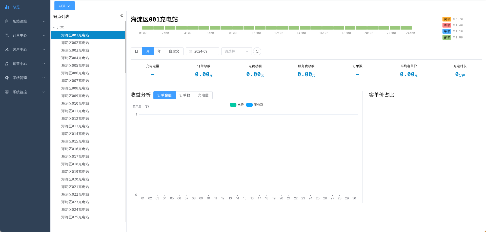

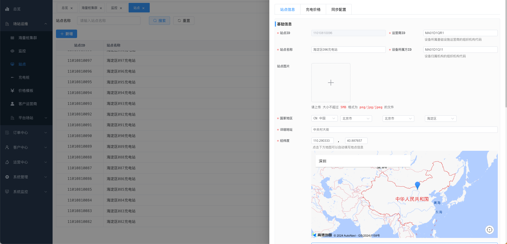

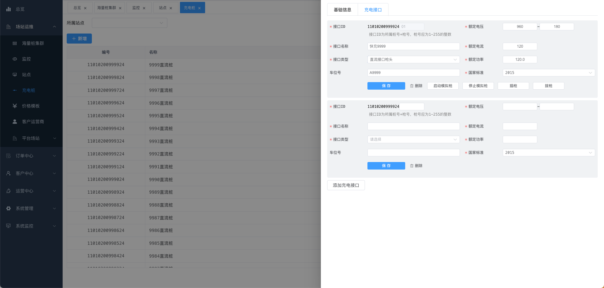

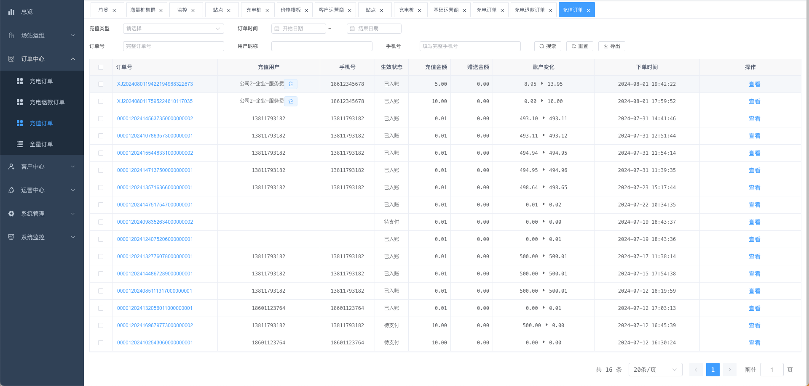

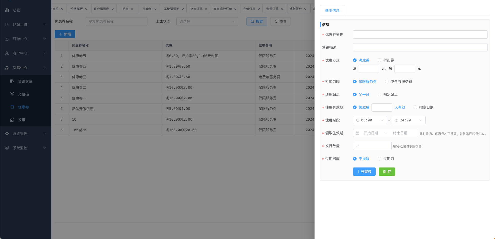

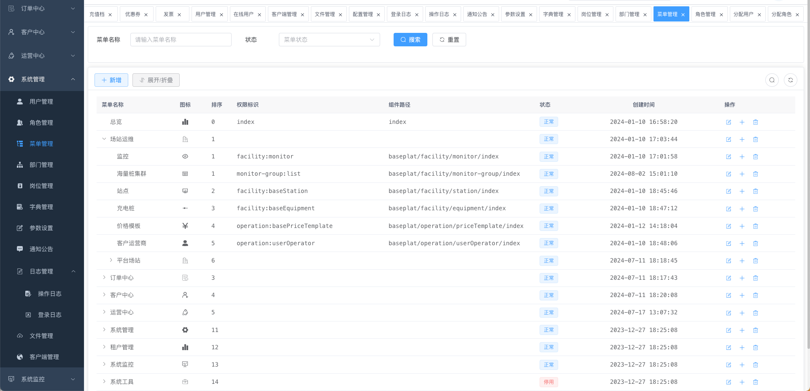

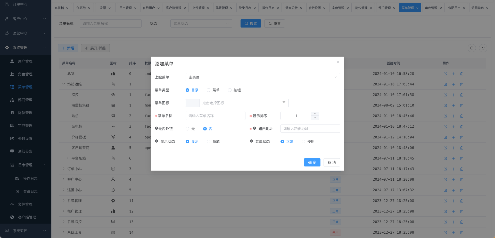

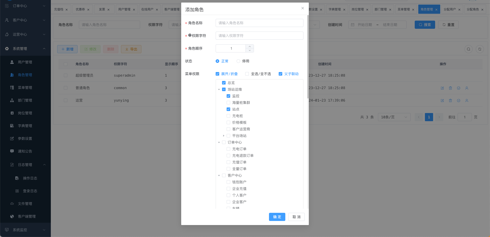

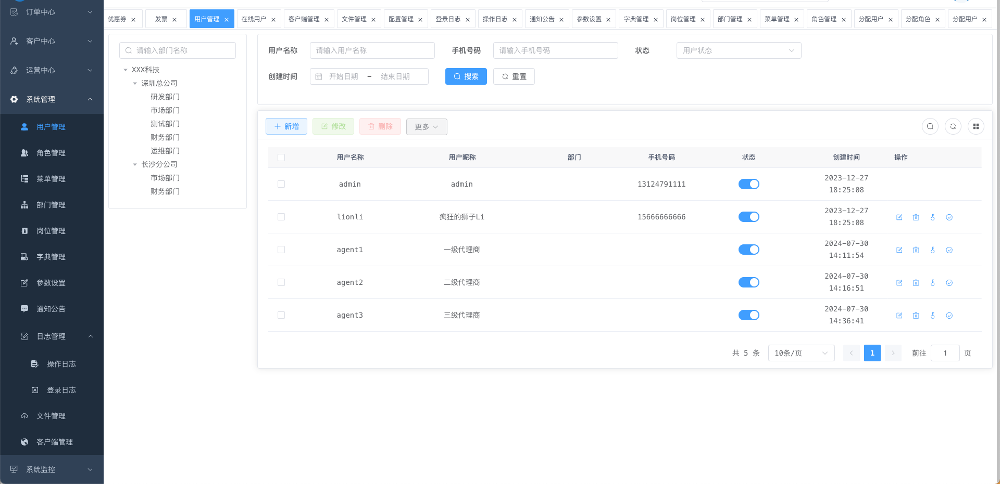
